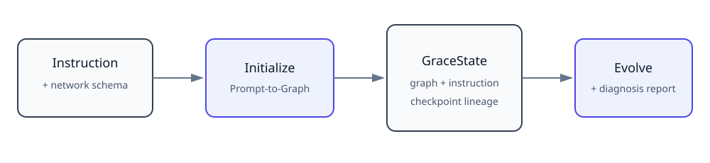
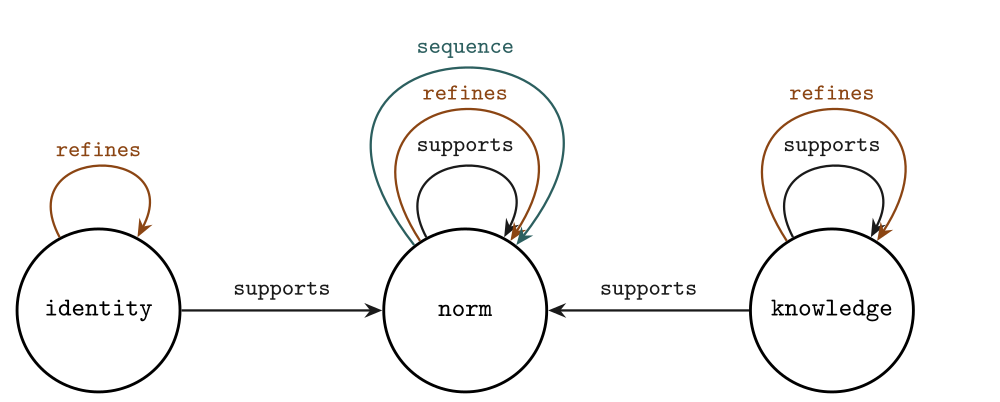
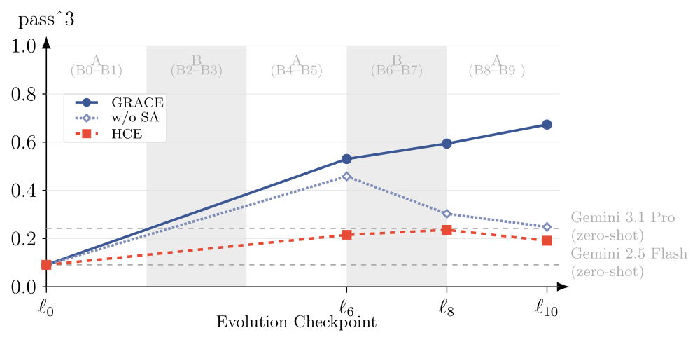

<!-- markdownlint-disable MD033 MD041 -->

<div align="center">
  
  <h1>Graph-Regularized Agentic Context Evolution</h1>
  <p><strong>Scoped Verification for Reliable Long-Horizon Agentic Context Evolution under Distribution Shift</strong></p>
</div>

<p align="center">
  <a href="https://github.com/RedMind-Research/GRACE/blob/main/docs/domain-integration.md"></a>
  <a href="https://github.com/RedMind-Research/GRACE/blob/main/docs/evolution-api.md"></a>
  <a href="https://github.com/RedMind-Research/GRACE/blob/main/docs/network-schema.md"></a>
  <a href="https://github.com/RedMind-Research/GRACE/blob/main/docs/providers.md"></a>
  <a href="https://github.com/RedMind-Research/GRACE/tree/main/examples"></a>
  <a href="https://github.com/RedMind-Research/GRACE/blob/main/reproduction/tau2_telecom/README.md"></a>
</p>

<p align="center">
  <a href="https://arxiv.org/abs/2607.09175"></a>
  <a href="https://github.com/RedMind-Research/GRACE/blob/main/LICENSE"></a>
</p>

<!-- markdownlint-enable MD033 MD041 -->

If you find our research useful or inspiring, please consider citing our work:

```bibtex
@misc{hsu2026grace,
      title={Scoped Verification for Reliable Long-Horizon Agentic Context Evolution under Distribution Shift},
      author={Dan C. Hsu and Luke Lu},
      year={2026},
      eprint={2607.09175},
      archivePrefix={arXiv},
      primaryClass={cs.AI},
      url={https://arxiv.org/abs/2607.09175},
}
```

Machine-readable citation metadata is available in [`CITATION.cff`](https://github.com/RedMind-Research/GRACE/blob/main/CITATION.cff).

## Intro

GRACE evolves the persistent system-level instruction of an LLM agent through a typed semantic graph. It converts diagnosis reports into scoped graph updates, validates those updates against a network schema, and reconstructs an updated instruction with integrity-bound checkpoint lineage.



The reusable contract is deliberately small:

```text
current graph + current instruction + diagnosis report
                    → GRACE Evolution
                    → validated graph + reconstructed instruction
```

Your agent stack remains responsible for collecting evidence, producing the diagnosis, approving deployment, and evaluating behavior. GRACE does not require a particular agent framework, benchmark, trajectory format, judge, or scoring rubric.

## Choose your path

| Goal | Start here | Delivery surface |
| --- | --- | --- |
| Apply GRACE to an agent in any domain | [Domain integration](https://github.com/RedMind-Research/GRACE/blob/main/docs/domain-integration.md) | Install `redmind-grace`, then import `grace` |
| Reproduce the paper's telecom procedure | [Tau² Telecom procedure](https://github.com/RedMind-Research/GRACE/blob/main/reproduction/tau2_telecom/README.md) | Clone the tagged repository and run `reproduction.tau2_telecom` |

The first path is the primary product surface and the repository's only Python distribution. The telecom workflow is checkout-only research code built on the same public API; it is deliberately excluded from the `redmind-grace` wheel and source distribution. The base installation never installs Tau² or LiteLLM.

## Install

GRACE supports Python 3.10–3.13. Install the provider-neutral core:

```bash
python -m pip install redmind-grace
```

The base installation is sufficient for a custom provider. Add the first-party Gemini adapter when needed:

```bash
python -m pip install 'redmind-grace[gemini]'
```

For development from a repository checkout, replace those commands with `python -m pip install -e .` or `python -m pip install -e '.[gemini]'`. From that checkout, run the deterministic, zero-network quickstart first:

```bash
python examples/offline_quickstart.py --artifact-dir ./grace_runs
```

For a live Gemini call through Vertex AI:

```bash
gcloud auth application-default login
gcloud auth application-default set-quota-project YOUR_PROJECT_ID
export GRACE_VERTEX_PROJECT=YOUR_PROJECT_ID
export GRACE_VERTEX_LOCATION=us-central1

python examples/quickstart_vertex.py --artifact-dir ./grace_runs
```

Google AI Studio is also supported. The engine itself depends only on the two-member `LLMProvider` protocol, so teams can install the base distribution without LiteLLM and connect an internal or external inference stack. See [provider setup and custom integration](https://github.com/RedMind-Research/GRACE/blob/main/docs/providers.md).

## Apply GRACE to your domain

A production integration has five steps:

1. **Choose a network schema.** Start with `DefaultGraceSchema`, or define a compact ontology for domain-specific object and relation types.
2. **Create state zero.** Convert an existing instruction with `GraceEngine.initialize()`, or validate an existing graph with `initialize_from_graph()`.
3. **Produce an actionable diagnosis.** Keep trajectories and internal evidence within your own system; pass only the report required for the update.
4. **Evolve and inspect.** Call `GraceEngine.evolve()` and review the accepted graph diff, validation report, reconstructed instruction, and provenance.
5. **Deploy through your existing stack.** Your runtime owns approval, evaluation, and the next evidence-collection cycle.

```python
import os

from grace import GraceEngine
from grace.providers import LiteLLMProvider, VertexAIADCConfig

provider = LiteLLMProvider(
    VertexAIADCConfig(
        project=os.environ["GRACE_VERTEX_PROJECT"],
        location=os.getenv("GRACE_VERTEX_LOCATION", "us-central1"),
    )
)
engine = GraceEngine(provider=provider, artifact_dir="./grace_runs")

initial = engine.initialize(
    instruction="You are an operations agent. Verify impact before taking action."
)
updated = engine.evolve(
    state=initial.state,
    diagnosis_report=(
        "Observed gap: the agent changed production state before confirming the "
        "affected service. Add an explicit service-identity verification step "
        "before any mutating tool call."
    ),
)

print(updated.state.instruction)
print(updated.change_log)
```

The released method default forwards an output-token limit of `65536`. For models with a smaller limit, set `GraceConfig(max_output_tokens=...)`; GRACE records the effective configuration and never silently clamps the request or switches routes.

### What makes a useful diagnosis

GRACE accepts Markdown or structured prose. A useful report identifies:

- the observed behavioral gap;
- the evidence or context supporting that finding;
- the affected instruction behavior;
- the desired correction and constraints that must be preserved.

Scores are optional. A diagnosis can come from an LLM analyzer, deterministic telemetry, human review, or a combined process. See the complete [Evolution API contract](https://github.com/RedMind-Research/GRACE/blob/main/docs/evolution-api.md).

### Default or custom network schema

The default schema described in the paper uses `identity`, `norm`, and `knowledge` object types with `supports`, `refines`, and `sequence` relations. It is a practical starting point.



Type-level loops in the diagram denote admissible relations between objects of the same type; they do not permit graph-instance self-loops. The `refines` and `sequence` relations are acyclic.

For a specialized domain, define a small ontology when semantic distinctions materially improve validation. Specify object types, relation types, allowed source/target signatures, natural-language definitions, and acyclicity constraints. The same `GraceEngine` runs without a domain-specific fork.

```bash
python examples/custom_domain.py --artifact-dir ./grace_runs
```

See [Network schemas](https://github.com/RedMind-Research/GRACE/blob/main/docs/network-schema.md) for the typed contract and custom schema example.

## API at a glance

| API | Input | Accepted output | Provider call |
| --- | --- | --- | --- |
| `initialize()` | system instruction | checkpoint `0`: graph + instruction | Yes |
| `initialize_from_graph()` | graph + system instruction | validated checkpoint `0` | No |
| `evolve()` | `GraceState` + diagnosis report | child checkpoint + change and validation reports | Yes |

Checkpoint writing is enabled by default. Every accepted artifact integrity-binds its state files and records the schema, configuration hash, parent identity, prompt provenance, model route, usage, and provider-attempt metadata for that step. With checkpoint or audit persistence enabled, GRACE verifies before a new provider call that the supplied state exists and matches its persisted record in the active run. See [Evolution API: persistence and resume](https://github.com/RedMind-Research/GRACE/blob/main/docs/evolution-api.md#persistence-and-resume).

## Research paper

GRACE is introduced in:

> **Scoped Verification for Reliable Long-Horizon Agentic Context Evolution under Distribution Shift**
>
> Dan C. Hsu and Luke Lu. [arXiv:2607.09175](https://arxiv.org/abs/2607.09175), 2026.

Across five independent telecom replications, the paper reports strict reliability (`pass^3`) increasing from `0.091` for the shared initial instruction to `0.673 ± 0.136` for GRACE at checkpoint 10. The paper provides the complete results and metric definitions.



## Reproduce the Tau² Telecom procedure

The optional research workflow publishes the pinned Tau² revision, exact task selection, phase schedule, model roles, sequential execution contract, fail-closed diagnosis, HCE comparison, and metric implementation.

Generated trajectories are not distributed. Reproducers create and retain their own trajectories and run artifacts through the configured provider APIs.

Clone the matching repository release and install the exact core and benchmark revisions:

```bash
git clone --branch v0.1.0 --depth 1 https://github.com/RedMind-Research/GRACE.git
cd GRACE
python -m venv .venv
source .venv/bin/activate
python -m pip install --upgrade pip
python -m pip install 'redmind-grace[gemini]==0.1.0'
python -m pip install -r requirements/reproduction.txt
```

Then inspect the exact episode count without credentials or provider calls:

```bash
python -m reproduction.tau2_telecom plan --evaluation in-loop:all
```

The complete ten-update schedule uses 420 experience episodes. Evaluating all 11 checkpoints uses another 2,178 episodes, for 2,598 total. Then run the procedure with:

```bash
python -m reproduction.tau2_telecom run-all \
  --method grace \
  --evaluation in-loop:all
```

The CLI reports `initialize`, `experience`, `diagnosis`, `evolution`, and `evaluation` progress. It also exposes each stage as an independent command for controlled execution and resume.

The paper's GRACE without structural analysis condition is available as `--method grace-no-sa`; it uses the same Prompt-to-Graph, task schedule, diagnosis, Evolution, models, and seed while disabling only model-assisted structural analysis.

## Repository architecture

The repository intentionally separates the reusable product from the benchmark workflow:

```text
src/grace/                  framework-neutral GRACE package
reproduction/tau2_telecom/  checkout-only paper reproduction
examples/                   executable product and custom-domain examples
docs/                       API, provider, schema, and integration guides
tests/                      deterministic product and reproduction tests
```

## Documentation

| Document | Purpose |
| --- | --- |
| [Domain integration](https://github.com/RedMind-Research/GRACE/blob/main/docs/domain-integration.md) | Connect GRACE to an existing agent stack |
| [Evolution API](https://github.com/RedMind-Research/GRACE/blob/main/docs/evolution-api.md) | Inputs, outputs, failure semantics, and persistence |
| [Network schemas](https://github.com/RedMind-Research/GRACE/blob/main/docs/network-schema.md) | Default schema and custom ontology contract |
| [Providers](https://github.com/RedMind-Research/GRACE/blob/main/docs/providers.md) | Gemini setup and the custom-provider contract |

The formal Tau² Telecom procedure and metrics are documented beside the research code in [`reproduction/tau2_telecom/README.md`](https://github.com/RedMind-Research/GRACE/blob/main/reproduction/tau2_telecom/README.md).

## Contributing and security

Development and release requirements are documented in [`CONTRIBUTING.md`](https://github.com/RedMind-Research/GRACE/blob/main/CONTRIBUTING.md). Report vulnerabilities privately according to [`SECURITY.md`](https://github.com/RedMind-Research/GRACE/blob/main/SECURITY.md).

## License

GRACE software, documentation, and original repository diagrams are licensed under the [Apache License 2.0](https://github.com/RedMind-Research/GRACE/blob/main/LICENSE), Copyright 2026 Dan C. Hsu and Luke Lu. The paper figure renderings in `assets/grace-network-schema.*` and `assets/pass3-checkpoints.*` are licensed under [CC BY 4.0](https://creativecommons.org/licenses/by/4.0/). Figure attribution, Tau² provenance, and its MIT notice are recorded in [`THIRD_PARTY_NOTICES.md`](https://github.com/RedMind-Research/GRACE/blob/main/THIRD_PARTY_NOTICES.md).
